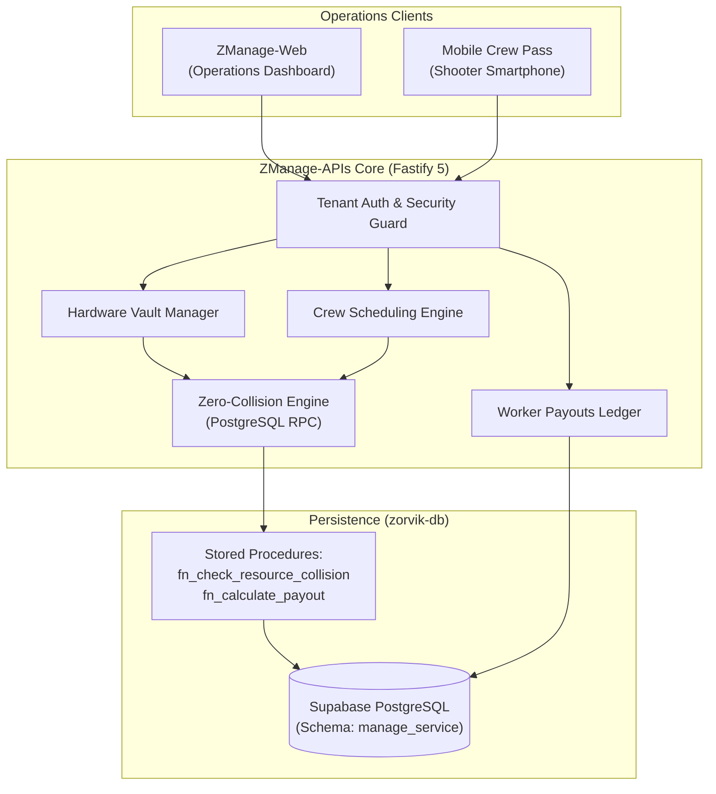

# ZManage-APIs — Internal Resource, Asset Vault & Crew Payouts API

> **Multi-Tenant Operations Microservice, Zero-Collision Booking Engine, Hardware Vault & Compensation Ledger**  
> Powers studio equipment tracking, freelance crew scheduling, conflict-free shoot bookings, and automated worker payouts for the Zorvik Tech ecosystem.

[](VERSION.md)
[](https://zorviktech.com)
[](https://www.typescriptlang.org/)
[](https://www.fastify.io/)
[](https://supabase.com/)
[](https://upstash.com/)
[](LICENSE)

---

## 🌐 Service Endpoints

- **Designated Production Gateway**: `https://manage-api.zorviktech.com` *(Upcoming / Staging)*
- **Local Development Server**: `http://localhost:4003`
- **Interactive OpenAPI / Swagger Documentation**: `http://localhost:4003/documentation`
- **Health Check**: `GET http://localhost:4003/health`

---

## 🌟 Executive Overview

**ZManage-APIs** is an enterprise operations and resource allocation microservice built on Fastify v5 and PostgreSQL. Designed specifically for high-capacity photography, cinematography, and production agencies, ZManage-APIs coordinates hardware assets (cameras, cinema lenses, drones, lighting trucks) and freelance crews with mathematical certainty. Its zero-collision booking engine guarantees that expensive gear and key cinematographers are never double-booked across overlapping shoots.

### Core Architectural Pillars
- **Zero-Collision Booking Engine**: Executes atomic PostgreSQL RPC functions (`fn_check_resource_collision`) that validate time-window bounds across shoot dates, locking resources instantaneously during checkout or dispatch.
- **Hardware & Gear Inventory Vault**: Comprehensive serial number tracking, physical condition grading (`excellent`, `good`, `fair`, `damaged`, `in_repair`), and check-out/return audit trails.
- **Crew Roster & 1-Tap Onboarding**: Imports platform users from `auth_service.tbl_client_users` into operational crew rosters with granular day rates, half-day rates, and overtime compensation rules.
- **Worker Payouts & UTR Settlement Ledger**: Tracks freelance compensation states (`pending`, `approved`, `settled`) with bank transaction UTR numbers and UPI payment reference hashes.
- **Multi-Tenant Dual-Mode Authentication**: Complies with standard Zorvik headers (`X-Tenant-ID`, `X-Publishable-Key`, and `Authorization: Bearer <sk_live_...>`).

---

## 🏛️ System Architecture & Operations Pipeline



---

## 🚀 Core API Modules

### 1. 📷 Hardware Gear Vault (`/api/v1/assets`)
- Complete CRUD for camera bodies, prime/zoom lenses, gimbal stabilizers, lighting packs, and drone kits.
- Condition audit logs: records inspector user ID, condition changes, and repair notes upon check-in.

### 2. 👥 Crew Roster & Scheduling (`/api/v1/crew`)
- Roles: Lead Photographer, Associate Photographer, Cinematographer, Drone Pilot, Lighting Assistant, Retoucher.
- Rate cards: Half-day (up to 4 hours), Full-day (up to 8 hours), Hourly overtime rate.
- 1-Tap bulk import from tenant user accounts.

### 3. 🛡️ Zero-Collision Bookings (`/api/v1/bookings`)
- `POST /api/v1/bookings/check-availability`: Pre-flight check returning real-time availability for arbitrary date-time windows.
- Atomic reservation locks preventing double-booking during concurrent dispatch.

### 4. 💰 Compensation & Worker Payouts (`/api/v1/payouts`)
- Automatically computes wages based on shoot duration, overtime hours, and contractual day rates.
- Records payment confirmation with Bank UTR, UPI ID, and settlement timestamp.

---

## 📁 Repository Directory Structure

```
ZManage-APIs/
├── src/
│   ├── config/              # Supabase, Redis, and environment configs
│   ├── controllers/         # Assets, Crew, Bookings, and Payouts controllers
│   ├── middleware/          # Tenant authentication, rate limiting, error handler
│   ├── routes/              # Route handlers (/assets, /crew, /bookings, /payouts)
│   ├── services/            # CollisionService, PayoutCalculationService
│   ├── types/               # TypeScript interfaces & validation schemas
│   └── app.ts               # Fastify app initialization & Swagger setup
├── .env.example             # Documented environment blueprint
├── eslint.config.js         # Strict ESLint configuration
├── package.json             # Scripts and dependencies
├── tsconfig.json            # TypeScript configuration
└── VERSION.md               # Version changelog
```

---

## ⚙️ Environment Configuration (`.env`)

Create `.env` using `.env.example`:

| Variable | Required | Description | Example / Target |
| :--- | :--- | :--- | :--- |
| `PORT` | Yes | Local server port | `4003` |
| `NODE_ENV` | Yes | Environment mode | `production` / `development` |
| `SUPABASE_URL` | Yes | Supabase PostgreSQL project URL | `https://your-project.supabase.co` |
| `SUPABASE_SERVICE_ROLE_KEY` | Yes | Elevated Supabase service key | `eyJhbGci...` |
| `UPSTASH_REDIS_REST_URL` | Yes | Upstash Redis connection endpoint | `https://your-redis.upstash.io` |
| `UPSTASH_REDIS_REST_TOKEN` | Yes | Upstash Redis authorization token | `AX...` |
| `SENTRY_DSN` | Optional | Sentry backend error tracking | `https://...@sentry.io/...` |

---

## 🛠️ Local Development & Quality Runbook

### 1. Install Dependencies
```bash
npm install
```

### 2. Start Development Server
```bash
npm run dev
```
Accessible at `http://localhost:4003` with Swagger docs at `http://localhost:4003/documentation`.

### 3. Run Strict Linting (Zero-Warning Policy)
```bash
npm run lint
```

### 4. Code Formatting
```bash
npm run format
```

### 5. Automated Test Suite
```bash
npm run test
```

### 6. Production Compilation & Start
```bash
npm run build
npm run start
```

---

## 👨‍💻 Founder & Architectural Leadership

**ZManage-APIs** is designed, architected, and maintained by:

- **Founder & Lead Architect**: **Vikash Kumar Singh**
- **Email**: [vikash@zorviktech.com](mailto:vikash@zorviktech.com)
- **Phone / WhatsApp**: [+91 8409792083](tel:+918409792083)
- **LinkedIn**: [linkedin.com/in/itsmevikashkumarsingh](https://www.linkedin.com/in/itsmevikashkumarsingh/)
- **GitHub**: [@ItsMeVikashKumarSingh](https://github.com/ItsMeVikashKumarSingh)
- **Website**: [zorviktech.com](https://zorviktech.com)

---

## 📄 License & Intellectual Property

**Copyright © 2026 Zorvik Tech. All Rights Reserved.**

This software and its associated source code, design systems, algorithms, and documentation are the proprietary intellectual property of **Zorvik Tech**. Unauthorized copying, reproduction, distribution, reverse engineering, or commercial use is strictly prohibited without prior written consent.
